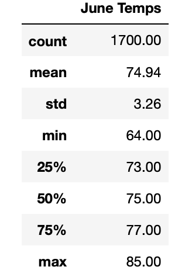
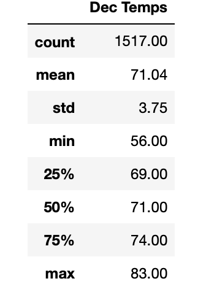

### Surfs Up Analysis
## Overview
The purpose of this analysis is to determine the sustainability of opening a sur and ice cream shop on the island of Oahu, Hawaii year round. 
To determine the sustainability of the business, temperature data was extracted for the months of December and June.

## Results
- The maximum temperate in June and December is 85 and 83 degrees and the minimum temperatures are 64 and 56 degress respectively.  This shows that there is a relatively stable range of temperatures throughout the year.
- The standard deviations for June and December are 3.3 and 3.7, thus the variation in temperature is more in December but still relatively similar to June's temperature variation.  In addition, the mean temperature in June is 75 degress and 71 degrees in December. Analyzing the mean temperatures in conjunction with the standard deviations indicates that December experiences greater deviation around its mean of 71 degrees.  This indicates that more colder temperatures occur in December in comparison to June. 
- The quartile ranges indicate that December has lower temperatures compared to June.

 

## Summary
Based on the results of the analysis, December experiences lower temperatures on average compared to June.  That being said, the range in temperatures throughout the year is relatively stable especially on the higher end of the temperature spectrum with the varaition only amounting to about 2 degrees difference.

To enhance the analysis, additional queries are provided in the file to show precipitation levels for both months.
